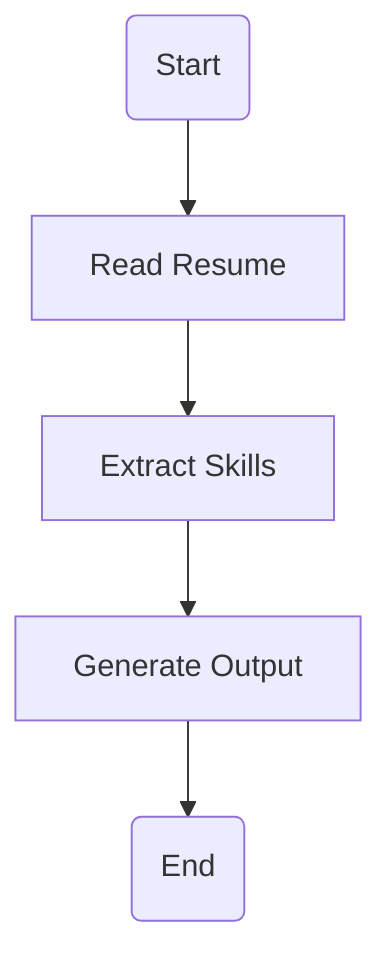

# 🚀 Resume Skills & Keywords Extractor using LangGraph + Groq

<p align="center">


</p>

---

# 📌 Project Overview

This project is an **ATS Resume Skills & Keywords Extractor** built using **LangGraph**, **LangChain**, and **Groq LLM**.

The application analyzes a **Resume** or **Job Description** and extracts **only the skills and keywords explicitly mentioned** in the text.

Unlike AI-based inference systems, this project **does not generate or predict additional skills**. It extracts only the information present in the input.

---

# ✨ Features

* ✅ Exact Skills Extraction
* ✅ Exact Keywords Extraction
* ✅ Uses LangGraph Workflow
* ✅ Uses Groq Llama 3.3 70B Model
* ✅ Generates Workflow Image (`graph.png`)
* ✅ Step-by-Step Terminal Execution
* ✅ Removes Duplicate Skills
* ✅ ATS-Friendly Output

---

# 🛠 Technologies Used

| Technology       | Purpose               |
| ---------------- | --------------------- |
| 🐍 Python        | Programming Language  |
| 🧠 LangGraph     | Workflow Management   |
| 🔗 LangChain     | Prompt Chaining       |
| ⚡ Groq API       | Large Language Model  |
| 🔐 python-dotenv | Environment Variables |

---

# 📂 Project Structure

```text
Resume-Skills-Extractor/
│
├── main.py
├── .env
├── requirements.txt
├── graph.png
└── README.md
```

---

# ⚙ Installation

### 1️⃣ Clone Repository

```bash
git clone https://github.com/your-username/Resume-Skills-Extractor.git

cd Resume-Skills-Extractor
```

---

### 2️⃣ Create Virtual Environment

```bash
python -m venv .venv
```

Activate

**Windows**

```bash
.venv\Scripts\activate
```

**Linux / Mac**

```bash
source .venv/bin/activate
```

---

### 3️⃣ Install Dependencies

```bash
pip install -r requirements.txt
```

or

```bash
pip install langgraph
pip install langchain
pip install langchain-groq
pip install python-dotenv
pip install graphviz
```

---

### 4️⃣ Create `.env`

```text
GROQ_API_KEY=your_groq_api_key
```

---

# ▶️ Run the Project

```bash
python main.py
```

---

# 🖥 Example Input

```text
Python Developer with experience in Python, FastAPI, SQLAlchemy, MySQL, Docker, Git, LangChain, LangGraph and REST API Development.
```

---

# 📤 Example Output

```text
Skills:
- Python
- FastAPI
- SQLAlchemy
- MySQL
- Docker
- Git
- LangChain
- LangGraph

Keywords:
- Python Developer
- REST API Development
```

---

# 🔄 LangGraph Workflow



---

# 💻 Terminal Execution

```text
==================================================
      Resume Skills Extractor
==================================================

Graph saved as graph.png

Enter Resume or Job Description

Python Developer with experience in Python...

==============================
Step 1 : Extracting Skills...
==============================

✓ Extraction Completed

==============================
Extraction Result
==============================

Skills:
- Python
- FastAPI
- SQLAlchemy
- MySQL
- Docker
- Git
- LangChain
- LangGraph

Keywords:
- Python Developer
- REST API Development
```

---

# 📊 Output

The project generates:

* 📄 Skills List
* 📄 Keywords List
* 🖼 Workflow Image (`graph.png`)

---

# 📦 Requirements

```text
langgraph
langchain
langchain-groq
python-dotenv
graphviz
```

---

# 📈 Future Improvements

* 📄 PDF Resume Upload
* 📑 DOCX Resume Support
* 🌐 Streamlit Web Interface
* ⚡ FastAPI REST API
* 📊 Export Results to CSV
* 📁 Export Results to JSON

---

# 👨‍💻 Author

**Jonnadula Naga Samba Siva Rao**

---

# ⭐ If you like this project

Give it a ⭐ on GitHub and share it with others!

**Happy Coding! 🚀**
